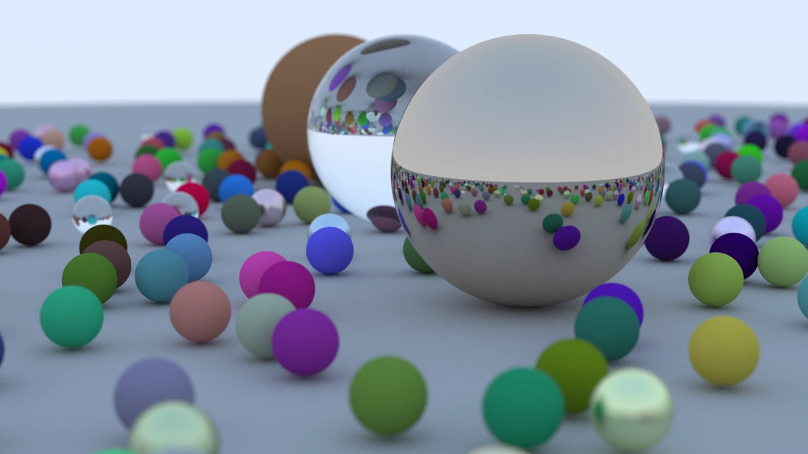

# Ray Tracing in One Weekend

This is my implementation of [Ray Tracing in One Weekend](https://raytracing.github.io/books/RayTracingInOneWeekend.html) in Rust.

At the time of commit the active version was `Version 4.0.1, 2024-08-31`.

I went through this to learn more about graphics as well as Rust.

The code in its current state will output the final scene.

Note that this took ~10 hours on a M1 Pro Max.



## Requirements

- `rustc`
- `cargo`

## Running

```shell
cargo run > images/final-sceme.ppm
```
